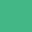
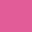
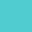
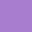
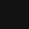
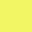

<h1 align='center'>
   
  
   
  Bit Theme
</h1>

A Dark Theme created by @pedro-henrique-sb.

## Color Palette

| Name                | HEX       | RGB             | Sample |
| ------------------- | --------- | --------------- | ------ |
| Mint                | `#41B883` | `65, 184, 131`  | 
| Mystic Maroon       | `#E25698` | `226, 96, 152`  | 
| Dark Pastel Green   | `#41B847` | `65, 184, 71`   | 
| Verdigris           | `#50CCD0` | `80, 204, 208`  | 
| Bright Navy Blue    | `#79B4E2` | `121, 180, 226` | 
| Dark Orchid         | `#A87CCF` | `168, 124, 207` | 
| Black Gray          | `#121212` | `18, 18, 18`    | 
| Rose Madder         | `#F55258` | `245, 82, 88`   | 
| Maximum Yellow      | `#F4F564` | `244, 245, 100` | 
| Tangerine           | `#F6A227` | `246, 162, 39`  | 

## Credits

Bit Theme is mainly inspired by [Omni Theme](https://github.com/getomni), a dark theme created by [Rocketseat](https://github.com/rocketseat). Thanks [Rocketseat](https://github.com/rocketseat) and all the [Omni Theme](https://github.com/getomni) contributors.
